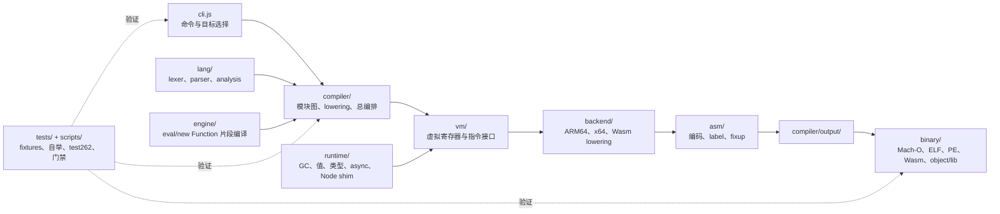

# asm.js 项目整体分析与目录级实施规划

> 制定日期：2026-07-27 · 2026-07-29 复核重定基线  
> 当前基线：`dev@a678f85`（最新 tag `v0.3.4`；test262 43.67%；fixtures 385 manifest / 门禁下限 380）  
> 进度台账：`docs/progress/2026-07-29-orchestration.md`（最新）；历史：2026-07-27、2026-07-26 台账

> **2026-07-29 复核结论（5 路只读审计实测）**：本规划的 P0 判断全部成立且仍开放——
> GATE-001（fixture gate 假绿：`bootstrap-gate.sh:50` 仍调简化版 runner，漏跑 5 个、伪装 2 个负向）、
> TARGET-001（`compiler/index.js:252-260` 仍双写本地 Targets，`platform_contract.mjs` 失败、
> `--list-targets` 仍 `[object Object]`）、FACTS-001（README v0.3.0/39.74% 落后四版，`plan.md` 头部
> v1.5.52/362 自称唯一事实源）。本轮 Wave 2 派工见 2026-07-29 台账 §4。

## 1. 执行结论

asm.js 已经不是“小型编译器原型”，而是一套约 9.6 万行 JavaScript 的完整
AOT 工具链：前端、lowering、虚拟指令、三种 backend、三种原生二进制格式、
Wasm、运行时、GC、Node shim、自举与 test262 都在同一个仓库内。

当前主矛盾不是缺少功能列表，而是**工程真值、跨层契约和验证门禁没有跟上能力增长**：

1. `runtime/`（约 4.8 万行）与 `compiler/`（约 2.7 万行）占代码主体，
   但对象布局、符号 ABI、目标平台和上下文切换等关键知识仍分散或双写。
2. bootstrap gate 使用了语义不完整的 fixture runner，385 个 manifest 只跑 380 个，
   并把两个应当编译失败但实际编译成功的用例记成 PASS。
3. `plan.md`、README、ROADMAP、测试文档和当前报告存在版本、基线、能力口径冲突。
4. 发布流水线没有 PR 门禁，且唯一原生冒烟允许失败后继续发布。
5. test262 39.74% 是有边界的 stride-5 子集成绩；它不能替代 fixture、自举、
   多平台、安全或格式级验证。

因此实施顺序必须是：

```text
恢复可信门禁
  → 收敛单一事实/契约
  → 关闭安全与静默错误
  → 推进语义一致性与 x64 自举
  → 渐进拆解 compiler/runtime 深层耦合
```

## 2. 架构与依赖流



期望依赖方向是“前端 → lowering → VM → backend → assembler → binary”。
`runtime/*Generator` 通过 VM 生成目标机器码；`runtime/node/` 的 JS shim 则进入模块图。
以下跨层边应被显式治理：

- `engine` 与 `runtime` 通过手工编号符号 ABI 相连。
- compiler 与 runtime 通过对象/数组布局和 NaN-box tag 相连。
- binary/Wasm 从 backend 读取常量，形成反向依赖。
- eval shim 形成 `runtime → engine → compiler → runtime` 的按需环。

## 3. 目录职责、边界与验证

| 目录 | 应承担的单一职责 | 不应继续吸收的职责 | 主验证 |
|---|---|---|---|
| `cli.js` | 参数、目标选择、用户诊断、输出生命周期 | 平台表副本、编译语义 | CLI 契约测试 |
| `lang/` | token、AST、语法、早期错误、静态分析 | runtime 语义补丁 | parser 正/负向 + test262 parse |
| `compiler/core/` | 编译上下文、类型、目标目录等共享契约 | 模块解析实现 | 纯契约测试 |
| `compiler/` | 模块图、AST lowering、运行时选择、编排 | 平台表副本、裸布局常量、发布逻辑 | repro + fixtures + 自举 |
| `vm/` | 稳定的虚拟指令/寄存器 seam | 目标格式逻辑 | backend 契约矩阵 |
| `backend/` | VM 指令到目标 ISA lowering | 文件格式、产品语义 | 指令编码 + 跨目标探针 |
| `asm/` | 指令字节、label、relocation/fixup | compiler 分派 | 范围/重定位边界测试 |
| `binary/` | 格式、段、入口、导入导出、链接 | compiler 语义 | readelf/otool/dumpbin 结构测试 |
| `runtime/core/` | 分配、GC、值表示、进程/线程底座 | Node 高层 API | 内存/ABI/并发探针 |
| `runtime/types/` | ECMAScript 类型内部方法 | 编译期语法分派 | test262 + 内存边界对拍 |
| `runtime/async/` | coroutine、Promise、异常传播 | Node stream 语义 | async fixtures + test262 |
| `runtime/node/` | 明确标注范围的 Node shim | 失败开放的安全壳 | vs Node 差分 + 负向安全测试 |
| `engine/` | PIC 片段编译与符号重定位 | 第二份符号清单 | eval/new Function fixtures |
| `tests/` | 测试数据、权威期望、专项 harness | 第二套 fixture 语义 | runner 自测 |
| `scripts/` | 唯一门禁入口、诊断和可复现工具 | 隐藏的产品逻辑 | shell/Node 自测 |
| `docs/` | 当前事实、设计决策、历史归档 | 互相竞争的“唯一事实源” | facts checker + 红队复核 |

## 4. 目录级任务图

### P0：先恢复可信真值

#### GATE-001：统一 fixture runner

- Owner：质量 agent
- 文件：`scripts/run-fixtures.mjs`、`scripts/bootstrap-gate.sh`、
  `tests/run_fixtures.mjs`、`tests/README.md`、两个负向 fixture manifest。
- 要求：
  - 只有一个 runner 实现 fixture 语义；旧入口只能做薄包装。
  - 覆盖全部 385 个 manifest 和自定义 `entry`。
  - 同时检查 parse/compile/run/stdout/stderr/exitCode。
  - FAIL、XPASS、manifest 漏发现必须非零退出。
  - 两个当前产品缺口显式记为 XFAIL，不得继续伪装 PASS。
- 验收：`PASS + XFAIL = TOTAL = manifest 数`，`FAIL=XPASS=0`。

#### TARGET-001：单一 TargetCatalog

- Owner：架构 agent
- 文件：`compiler/core/platform.js`、`compiler/index.js`、`cli.js`、
  `tests/platform_contract.mjs`。
- 要求：
  - release 的五个原生目标与实验性 `wasm32-wasi` 由单一目录定义。
  - Compiler、CLI、release 校验消费同一目录。
  - 不再公开未实现的 Windows ARM64。
  - alias 与未知目标行为有机器测试。
- 验收：每个 `--list-targets` 条目均可构造 Compiler；输出不含 `[object Object]`。

#### FACTS-001：当前事实单源化

- Owner：主控
- 文件：`plan.md`、README 中英、ROADMAP、tests README、progress 文档；
  后续新增 facts checker。
- 要求：版本、fixture 状态、test262 选择边界、自举平台、发布能力不互相冲突。
- 验收：所有活跃文档命令存在；红队逐条核对能力声明。

### P1：安全与发布完整性

#### CI-001：发布前置门禁

- 新增 PR/push CI；release 只消费已通过门禁的不可变 SHA。
- 去掉 `continue-on-error` 冒烟；手动 tag 必须验证指向当前 SHA。
- 五目标至少各有格式校验，原生/QEMU/Wine 运行验证逐步补齐。

#### TMP-001：私有临时目录

- `cli.js run` 与静态库生成改用 0700 的 `mkdtemp` 目录。
- 避免可预测文件、符号链接覆盖和同 basename 的并行污染。

#### CRYPTO-001：安全 API fail-closed

- 未知 hash、ECDH/FIPS 空壳不得成功返回。
- `randomInt` 使用拒绝采样并校验范围。
- 所有负向行为与 Node 对拍。

#### LINK-001：未完成链接能力显式失败

- 在真实 relocation/架构/符号校验完成前，`--lib`、`--lib-path`、不可靠的
  `--static` 路径必须响亮报不支持，禁止生成已知错误产物。

#### HARDEN-001：产物格式安全属性

- ELF：PIE 与不可执行栈。
- PE：ASLR、DEP 与有效 relocation。
- 以格式解析工具和运行测试双重验收。

### P1：跨层契约单源化

#### ABI-001：engine/runtime 符号 manifest

- 统一 `engine/compile.js` 与 `runtime/core/allocator.js` 手工同步的符号序号。
- 检查 ID 连续、唯一、双向一致，所有 fragment fixup 可解析。

#### LAYOUT-001：对象/数组布局 manifest

- 先只做常量收敛，不同时重写行为。
- compiler、GC、subscript、print、object/array/typedarray 使用同一布局定义。
- 删除或隔离 24 字节旧数组头死实现，防止未来误接线。
- 这是自举敏感任务，必须按类型小步、逐步过完整 gate。

#### CTX-001：编译上下文事务

- 将 module/function/class/method 的 `ctx/sourcePath/moduleAst` 保存恢复封装为
  `try/finally` 事务。
- 验收“编译一次故意失败后，同一 Compiler 实例仍能正确编译最小程序”。

### P2：一致性与架构深化

#### MODULE-001：提取 `compiler/modules/`

- 迁移模块图、package exports、CJS/ESM 和 shim feature plan。
- 先保持模块顺序与产物不变，再修语义。
- 字符串/注释中的特征文本不得误触发 shim。

#### CALL-001：按调用族拆 `compileCallExpression`

- 当前方法约 4,000 行；按 Math、Array/TypedArray、Map/Set、Node shim、
  generic call 逐族迁移。
- 每批只移动一族，不同时改 ABI；禁止一次性大重构。

#### T262-001：可复现 test262

- 固定 corpus commit 与归档摘要。
- 报告记录 corpus SHA、runner SHA、选择目录、排除特性与 stride。
- 移除本机绝对路径；不同 corpus 身份不得直接比较趋势。

#### X64-001：x64 自举恢复

- 以普通五目标产物绿和 x64 自举定点为不同指标。
- 先补 branch/reloc 范围断言与最小布局 repro，再恢复 devirtualization。

### P3：长期能力

- Node shim 按模块建立“支持 / 部分 / fail-closed / 不支持”矩阵。
- 继续 test262 地基：对象内部方法、函数对象、迭代协议、async abrupt completion。
- backend/binary 先补契约测试，再深化抽象；没有第二个真实复用者时不保留浅基类。
- 性能改动必须同时报告自编译时间、产物大小、fixtures/test262 和定点状态。

## 5. 多 agent ownership 规则

1. 主控维护任务卡、文件 owner、依赖顺序和最终门禁。
2. 同一时刻一个文件只能有一个实施 owner；只读审计不取得 ownership。
3. agent 不使用共享 `git stash`，不批量 `git add .`，不触碰用户 `.claude/`。
4. worktree gate 必须用 `git rev-parse --git-common-dir` 定位公共锁；
   最终完整 gate 只由主控串行执行。
5. 实施 agent 提供最小复现和局部测试；红队独立复现，不接受只给结论。
6. 发现 P0 假绿、静默错编或安全失败开放时，暂停后续产品集成，先修真值。

## 6. 分层验收矩阵

| 变更面 | 必跑 |
|---|---|
| 文档 | facts 路径/数字核对、命令存在性、红队声明复核 |
| CLI/平台目录 | platform contract、help/list/unknown target |
| fixture runner | runner 自身正负向测试、385 manifest 全发现、退出码 |
| parser | 最小正/负向、相关 fixture、test262 parse 样本 |
| compiler/runtime | Node 对拍 repro、权威 fixtures、完整自举定点 |
| 布局/GC/ABI | 上述全部 + 内存边界/异常恢复/符号双向检查 |
| backend/asm | opcode/branch/reloc 契约、目标探针、完整自举 |
| binary | 格式解析工具、入口/段/reloc、安全属性、目标运行 |
| Node security shim | 正常路径、恶意输入、失败关闭、vs Node 差分 |
| test262 修复 | 精确目标用例 + 固定 corpus 抽样，无新增 CRASH/COMPILE_FAIL |

## 7. 本轮停止条件

本轮只有同时满足以下条件，才能称“首批规划已实施”：

- fixture gate 已从假绿修为单一权威 runner。
- TargetCatalog 已单源化且契约测试通过。
- 当前事实、目录计划和实施进度文档已同步。
- 权威 fixture 结果按 PASS/XFAIL/FAIL/XPASS 诚实报告。
- 产品代码改动通过完整 bootstrap gate；若受沙箱网络限制，必须明确记录并在获准
  的非沙箱环境复验，不能把受限环境失败改写成通过。
- 独立红队完成二次 diff 审计，P0 无未处理项。
